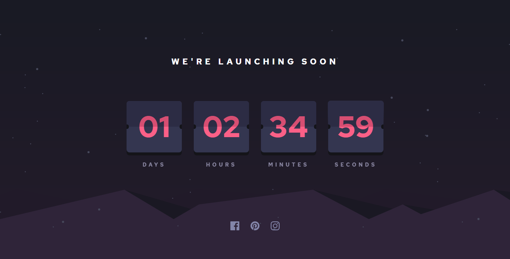

# Frontend Mentor - Launch countdown timer solution

This is a solution to the [Launch countdown timer challenge on Frontend Mentor](https://www.frontendmentor.io/challenges/launch-countdown-timer-N0XkGfyz-). Frontend Mentor challenges help you improve your coding skills by building realistic projects. 

## Table of contents

- [Overview](#overview)
  - [The challenge](#the-challenge)
  - [Screenshot](#screenshot)
  - [Links](#links)
- [My process](#my-process)
  - [Built with](#built-with)
  - [What I learned](#what-i-learned)
  - [Continued development](#continued-development)
  - [Useful resources](#useful-resources)
- [Author](#author)
- [Acknowledgments](#acknowledgments)

### The challenge

Users should be able to:

- View the optimal layout for the site depending on their device's screen size
- See hover states for all interactive elements on the page

### Screenshot

I did not include the mobile screenshots since it is very long ahahaa

### Links

Live Site URL: [Live site of the challenge hosted here](https://pikapikamart.github.io/frontendmentor-launchdown/)

## My process

Hello, this is my 18th challenge here in FEM. Almost been months since I posted my last solution in FEM, I have been studying a lot of frontend/backend with just myself and creating different web application which I designed so that I could enhance as well my designing skills. This is really important because you should be building up this knowledge with all things doing by yourself. FEM has been a great support for me and I can't thank it enough^^. This challenge was really fun because of the flipping animation and using different 3d-ish css. I am really happy if you liked it ^^

### Built with

- Semantic HTML5 markup
- CSS custom properties
- FlexBox
- Grid
- Sass preprocessor

I said that I won't use any frameworks and build it from scratch to be more exciting and challenging

### What I learned

I learned in this project that animations can be quite a tricky but manageable. Though I really want to support accessibility in here, but really hard for me to maket this one. I supposed this is really a challenge for just visual. But I am now always trying to practice accessibility and I am really proud of it^^.

### Continued development

I want to focus more on creating more complex designs and also designing things on my own time

## Author

- Website - Well I haven't made my profile portfolio, gonna make it sooon when I know a lot of stuffs
- Frontend Mentor - [@pikamart](https://www.frontendmentor.io/profile/pikamart)
- Twitter - [@RaymartPamplona](https://twitter.com/RaymartPamplona)